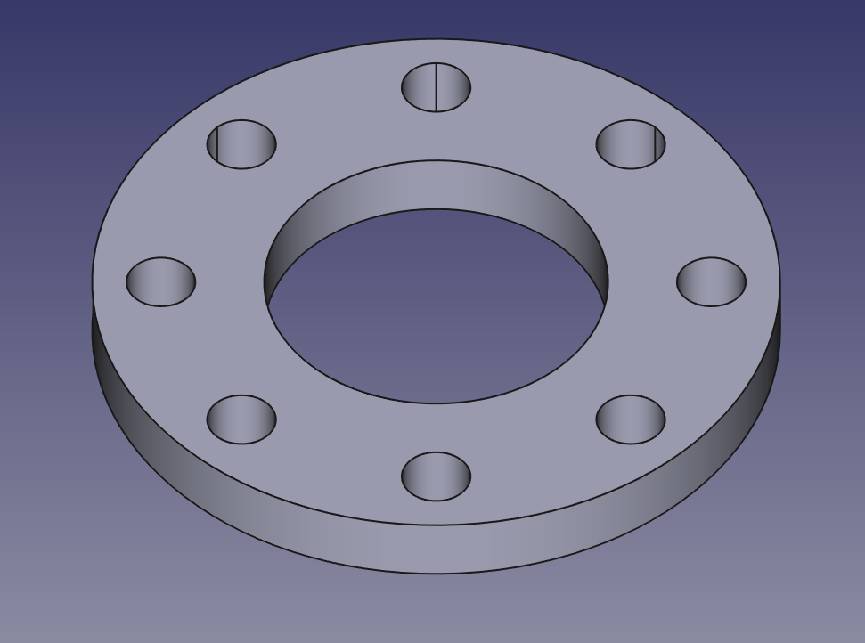
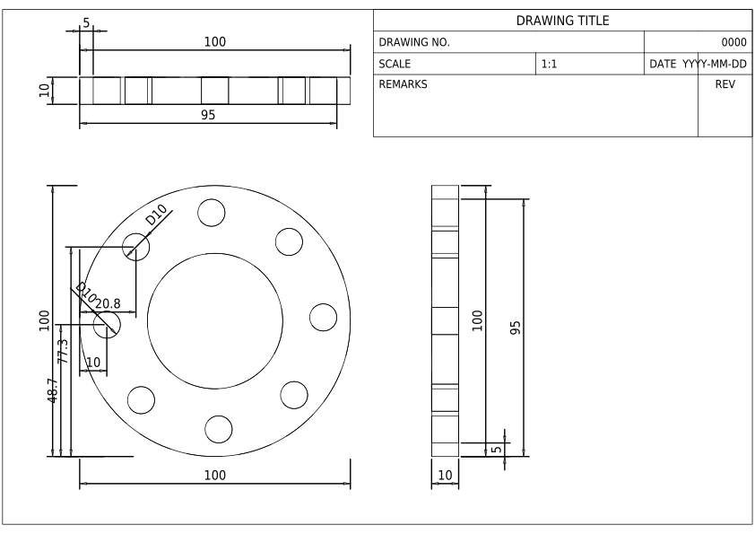

# 2D CAD Drawing generation from 3D CAD models

This tool is used to generate 2D CAD drawings from 3D CAD models.

## Installation

```bash
pip install cad-3dto2d
```

## Usage

```
python scripts/gen2d.py --step_file </path/to/step_file> --template A4_LandscapeParam --add_dimensions
```

## Demo



