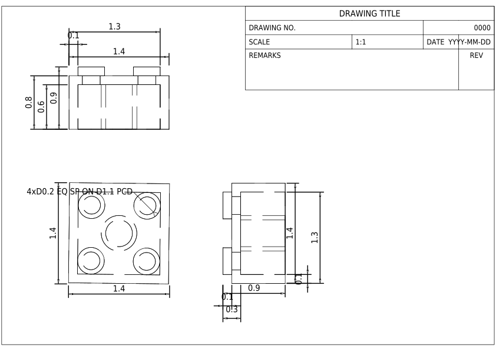

# 2D CAD Drawing generation from 3D CAD models

This tool is used to generate 2D CAD drawings from 3D CAD models.

## Installation

Install the package from PyPI:

```bash
pip install cad-3dto2d
```

Or install the package from the source code:

```bash
git clone https://github.com/neka-nat/cad-3dto2d.git
cd cad-3dto2d
uv sync
```

## Usage

```
python scripts/gen2d.py --step_file </path/to/step_file> --template A4_LandscapeParam --add_dimensions
```

Batch generation for machine-learning datasets (random template/style/scale/layout):

```bash
python scripts/gen2d_batch_random.py \
  --input_dir path/to/3d_models_dir/ \
  --output_dir path/to/output_dir/ \
  --recursive \
  --variants-per-step 3 \
  --random-side-position \
  --random-top-position \
  --workers 4 \
  --layout-scale-min 30 \
  --layout-scale-max 70 \
  --layout-offset-x-min -20 \
  --layout-offset-x-max 20 \
  --layout-offset-y-min -20 \
  --layout-offset-y-max 20 \
  --seed 42
```

If you do not need template-based layout alignment, add `--no-use-template-layout` for faster generation.

## Demo

### Original 3D model (Flange)


### Generated 2D drawing (Flange)


### Original 3D model (Lego Block)


### Generated 2D drawing (Lego Block)

